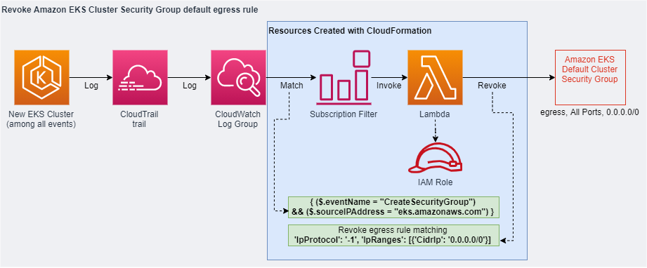

# Revoke EKS Cluster Security Group Egress Rule

## Purpose

This CloudFormation script creates resources to automate [the security recommendation to revoke the egress rule for Amazon EKS Cluster Security Group](https://github.com/aws/containers-roadmap/issues/1355).

A Lambda function is invoked based on the following Log Group subscription filter. The Lambda function revokes the default egress rule during the cluster creation phase and prior to the endpoint becoming available.

`{ ($.eventName = "CreateSecurityGroup") && ($.sourceIPAddress = "eks.amazonaws.com") } `

## Assumptions

This script assumes you have an existing CloudTrail trail which writes to a CloudWatch Logs Log Group. You may have created this through AWS account automation. You pass in your CloudWatch Logs Log Group name as an argument. This script also assumes that the CloudWatch Logs Log Group does NOT already have 2 subscription filters associated with it as per [current limit](https://docs.aws.amazon.com/AmazonCloudWatch/latest/logs/Subscriptions.html). Alternatively, you could modify the template to add in the CloudTrail trail and required resources.

## What Next?

After you deploy your Amazon EKS cluster, you would need to add in your Security Group egress rules for the data plane node groups with least privilege based on the outbound rules recommended as least privilege in the [Amazon EKS security group considerations doc](https://docs.aws.amazon.com/eks/latest/userguide/sec-group-reqs.html).

## Visual Representation

## Security

See [CONTRIBUTING](CONTRIBUTING.md#security-issue-notifications) for more information.

## License

This library is licensed under the MIT-0 License. See the LICENSE file.
